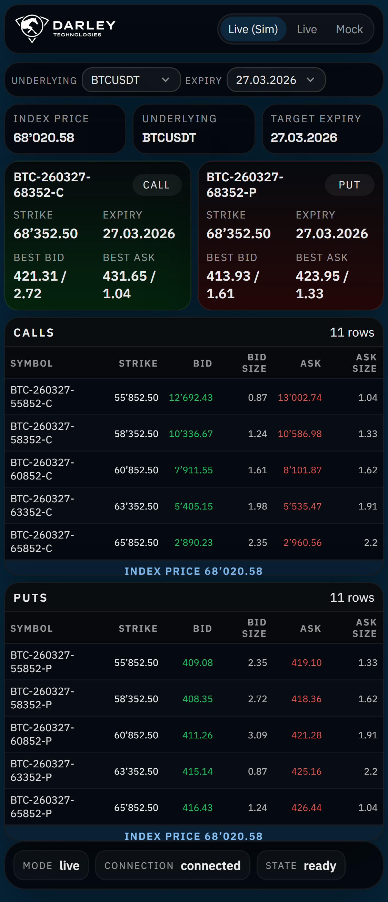
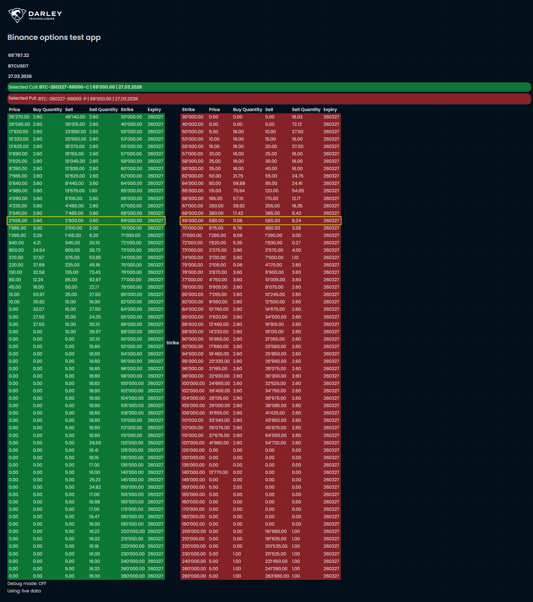
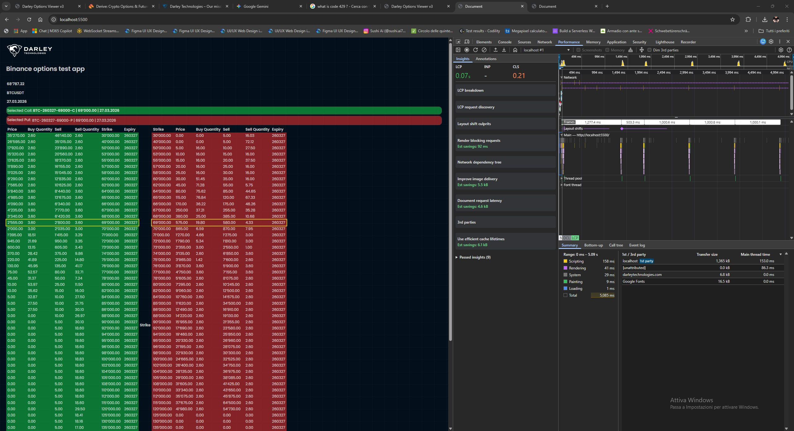
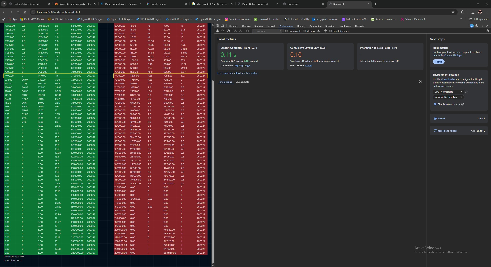
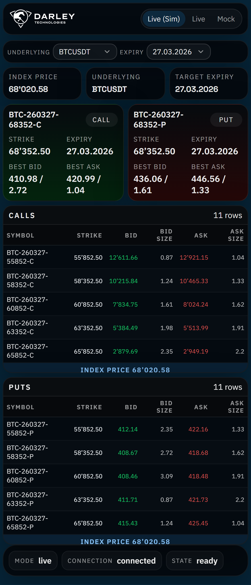
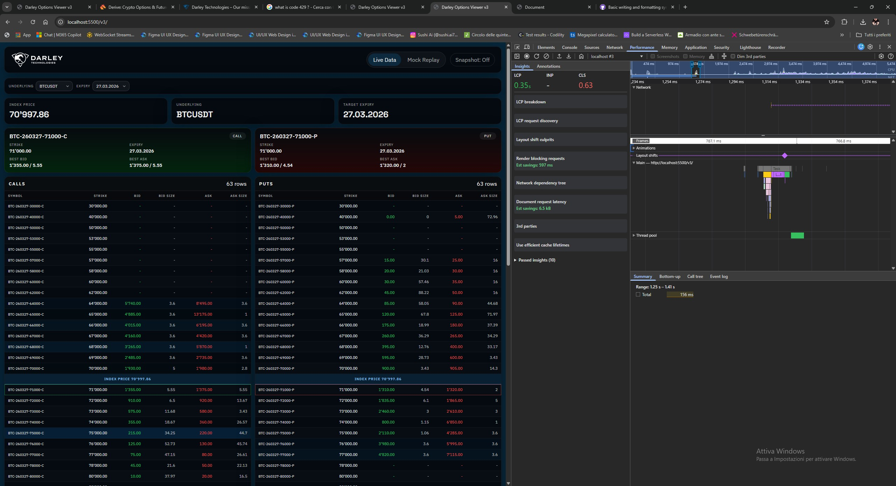
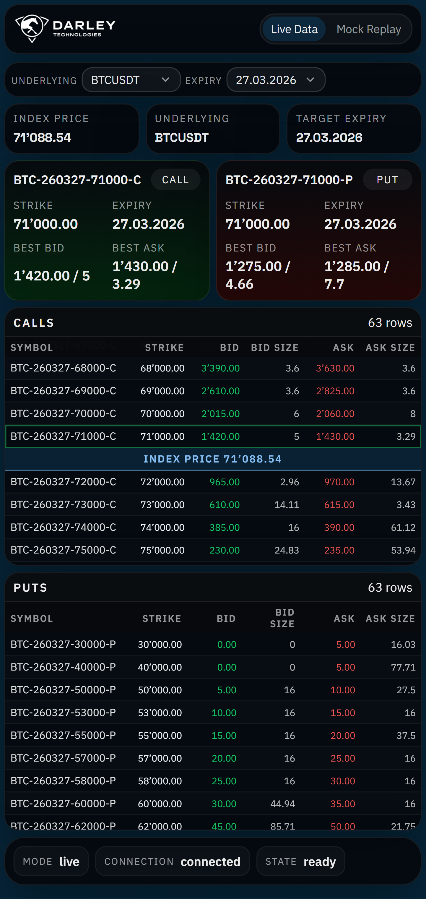

# Options visualization Project

This repo contains three iterations of the same assignment.

If you only open one version, open the final one: https://efdesign.github.io/darley/v4/dist/index.html

I kept the earlier versions on purpose, so it is easy to see both the manual baseline and the later refinements.

**v1 (hand-coded baseline, default route)**: https://efdesign.github.io/darley/
- core manual implementation used to satisfy the brief constraints first
- no LLM usage in phase 2 and phase 3
- basic GUI and simple scripting, it proves the requirement path end-to-end

**v3 (structured vanilla refactor)**: https://efdesign.github.io/darley/v3/dist/index.html
- same core behavior, reorganized with better modularity and separation of concerns
- still minimal in dependencies, with a more polished responsive UI

**v4 (final product)**: React port of v3
- version considered final for presentation
- important caveat: v4 uses React dependencies (similar to Binance frontend stack), so it does not strictly meet the brief's minimal-dependency requirement
- dependency scope is still intentionally minimal: only React + Vite, with no extra React libraries for state management, forms, or CSS frameworks
- for strict dependency compliance, v1 (and largely v3) is the reference implementation
- reflects the balance: brief compliance first with hand-coded foundations, then smarter iteration with machine-assisted refactoring and UI polish

In short: v1 demonstrates the manual compliance baseline, v4 is the final deliverable, and v3 show the progression between those two points (there was a v2 but i skipped it as it diverged due to cleanup of v1)

## Author and Usage Notice

- Author: enrico.furlan
- Email: enrico.furlan@gmail.com
- License: Proprietary Evaluation License (see [LICENSE-EVALUATION.md](LICENSE-EVALUATION.md))

This repository is intended for interviewer review and evaluation only.

# Dev diary

I've developed this test over three days, from Sunday 22nd to Tuesday 24th.

During the first two days I was hand-coding and understanding the domain brief and requirements.
I then built a first WIP specifically without using LLMs for phase 2 and phase 3.
The goal was a working product fulfilling the requirements:

- coded in vanilla JS to minimize dependencies
- worked towards integrating REST and WebSocket calls, with early tests in the trash folder starting from test.js
- implemented linear instrument selection
- built a basic GUI to display the data
- in this phase I did not look too deeply into architecture, modularity, or GUI refinement
- as a small bonus, I also looked at the Darley website to get an idea of the corporate branding colors

On Tuesday I used LLMs to refine the work for responsive GUI, better modularity, and cleaner architecture by porting and restructuring the code from the first two days.
LLMs are much faster for this kind of refinement, so I managed to produce two more polished GUIs starting from the manual versions.

## Saturday 22nd, 13-17 (Analysis, Part1, Learning and Api tests)

- 13:00 - 13:30,

  Not being an expert in stock options, I spent 30 minutes analyzing the brief. I used Gemini to clarify the term Instrument.
  - chosen the architecture:
    - Single file application (HTML with embedded JS and CSS for now, depending on final size)
    - Stick to **vanilla.js** (to comply with the minimal/no dependency requirement and minimize supply chain attacks)
    - Plan is to move to web components or React later and evaluate or benchmark if possible. Of course this is a demo project, so I might not implement security features that are already present in those frameworks. Using established frameworks would of course have positive tradeoffs.
    - ...also skipped TS for now since I was in a rush and evaluating whether to do another version later
    - not writing tests at this stage. Given more time I would likely do TDD, as it would make the project more maintainable and avoid surprises in the long run
    - since I have a GitHub account, I chose to **host** static HTML **on GitHub Pages**
    - thinking about layout in the back of my mind. I still did not have a clear GUI in mind, but I knew the T-shape is standard, though maybe not ideal on mobile. I planned to approach mobile first, but only after the initial API integration and fetching if time allows.

- 13:30 - 15:00, lunch break

- 15:00 spent one hour building the test.js script and checking the provided WS and REST endpoints, both whether they worked and what data format they returned
  - 15:10 some did not return data. I needed to understand why, and it was probably the parameters
  - 15:20 found and installed the Postman Binance API collection from: https://github.com/binance/binance-api-postman to verify I was using the right APIs and configuring them correctly
  - 15:40 tested the APIs and saw that in Postman I had no CORS issues, but confirmed that CORS issues were there from Binance for certain APIs. I did not try to get credentials as they should be free
  - 16:10 registered, wrote a script, and bypassed CORS issues with a [cloudflare proxy](cloudflare/worker.js). If I had a local backend this would be handled with a local proxy, or I would check the API documentation better. In any case this comes close to a "serverless" architecture
  - 16:20 formatted a bit this document

16:20 - 16:30, break re-reading brief

16:30 - 16:46 **PART 1 self evaluation** (1 to 10)

- html, js, css: overall...8
- binance api: 1 (first time user, hard requirement from brief)
- cloudflare services: 1 (first time user, I did quick research and since I wanted to host on GitHub Pages, due to limitations I likely needed a proxy to bypass CORS)
- github and github services: 5 (I've used several features in the past, I'm 7+ with Git version control, I have used Actions and hosting for some projects, and also did courses on Copilot at Cognizant)

## Monday 23rd, 9:30 - 19 (Part 2 and Part 3)

9:30 - 12:00  aprt 2 - DATA Prep and algorithm - no LLM

- data preparation (and more learning)
- algorithm to find the instruments and strike price (manual implementation)

  13:00 - 15:00 lunch break

15:00 - 19:00 part 3 - UI and WS updates (manual)
 
- wired most of the logic (at this point I added GUI logic and components)
- clarified if I wanted to show all the instruments for a selected expiry date (based on what is calculated in phase 2)
- built a row to visualize strike, underlying (for example USDT + BTC), and expiry
- built the selected options cards using the 1 put and 1 call from phase 2
- built a basic GUI for displaying data in a two-table layout (this can be improved later)
- highlighted selected instruments
- connected to websocket and updated rows by id (here it could have been optimized)
- started to look at Lighthouse performance hints (fonts, image sizes, layout thrashing, etc.)

## Tuesday 24th, 9 - 18 (Part 3 with LLM, Part 4, Readme.md, upload to githup, add licensing)

Here I went ahead and refined the frontend architecture and GUI based on the fact that I could use LLMs

- 9:00 - 9:15 built a slightly optimized version with index.optimized.html with LLM
- 9:15 - 10:00 built a v3 no dependency version with better responsive GUI and refactored code (split into modules for more maintainability)
- 10:00 - 11:15 built a v4 React version with LLM. This is a port of v3 and reuses most code from v3 while porting certain concepts to React for state management, componentization, and hooks. This could have been expanded further with additional frameworks, for example TanStack, while still minimizing dependencies. At the moment it only uses React 19 and Google Fonts. I noticed AI was firing off more requests than in v1, which triggered usage limits, so I added a snapshot trigger and left it off by default in the v3 and v4 GUIs.
- 11:15 - 12:15 uploaded to GitHub Pages and found some looping issues introduced by LLM output when switching expiry and underlying, due to multiple calls for ask/bid for each row, which would trigger usage limits. I had not instructed it to do that, but it was quite proactive when optimizing the flash updates on the rows.

- 12:30 - 14:00 break
- 14:17 - cleaned up v1 as it was not good to present (organization wise, logic wise has some leftovers todo)

*Note:* the base REST endpoints used for overview data do not provide full bid/ask quote fields. In practice, those values are populated when WebSocket messages arrive. The optional snapshot path can prefill them, but it still needs better tuning and API validation. If I had more time, I would investigate additional Binance endpoints and improve that path.

## Part 4: Retrospective

### Code reviews (run at 19:00 on Tuesday 24th)

At the end of the day I ran a senior-level code review against the brief for each with AI version.
The full reports are here:

- [report-v1.md](documentation/report-v1.md) — monolithic baseline (`app.js` / `index.html`)
- [report-v3.md](documentation/report-v3.md) — modular vanilla ESM refactor
- [report-v4.md](documentation/report-v4.md) — React 19 + Vite final version

The most structurally important finding — and the one I would prioritise fixing first — is the **algorithm correctness gap in v1**: the actually-called function `findNearestOptions` selects the best CALL and the best PUT **independently**, so they can end up on different expiry dates, violating brief requirement #1 ("their expiry is on the next Friday"). A correct two-pass implementation (`findNearestOptionsV2`) exists in the same file but is **never called**. V3 and V4 both carry the correct shared-expiry algorithm (`selectNearestOptions` in `domain/selectNearestOptions.js`): the first pass fixes a single `chosenExpiryKey` for the whole expiry, then the second pass picks the ATM strike for each side within that expiry only. This is the implementation that fully satisfies the brief for all three versions that matter (v3 and v4 are correct).

A close second priority, shared across all three versions, is the **`getNextFriday` time-of-day case**: on Friday after 08:00 UTC (when Binance options expire) the function returns today rather than the following Friday, causing the algorithm to target an already-expired expiry for the remainder of that day.

If I had more time, I would fix the remaining open issues listed in each report before anything else.

---

### If I had 1 week

The first week would be focused on turning the current prototype into a cleaner and safer MVP without changing the scope too much.

- finish the remaining product polish in the current feature set rather than adding many new features
- remove duplication between v3 and v4 where possible, because right now the domain and application ideas are similar but maintained twice
- improve non-happy-flow handling: loading states, empty states, proxy failures, websocket disconnects, stale data, and clearer user-facing error messages
- add request throttling and stronger reconnect/backoff rules, especially for GitHub Pages usage where excessive REST calls can hit limits quickly
- keep the snapshot toggle off by default and review every live request path so the app behaves closer to v1 unless a richer mode is explicitly enabled
- make index price updates truly real-time and re-trigger the call/put selection calculation when the live index changes, because right now those calculations are not continuously recomputed
- add basic linting and a small automated test layer around the selection algorithm, date policy, symbol parsing, and normalizers
- document the architecture and explicitly document where LLMs were used and where they were intentionally not used
- do another pass on responsive behavior and real-device testing, because I only validated on my own phone and desktop browser
- continue layout-shift optimization (already improved in v1-v3 and decent in v4), especially around live table updates and summary/status blocks

### If I had 1 month

At one month, I would move from MVP hardening to maintainability and product quality.

- migrate the codebase to TypeScript for stronger contracts around exchange payloads, quote rows, view models, and websocket messages
- introduce a proper test strategy: unit tests for domain logic, integration tests for clients/use-cases, and a few end-to-end checks for the core user flows
- add CI checks for build, lint, and tests so regressions are caught before publishing 
- review whether the current UI is the best representation of the data density; I would prototype a stronger table focused on usability and readability, while aligning typography, spacing, and visual hierarchy more closely with company branding guidelines
- improve accessibility: keyboard navigation, clearer focus states, screen-reader labels, and stronger contrast validation
- expand the market data only where it clearly adds value, for example open interest or other fields that help contextualize the selected call and put
- improve observability with lightweight diagnostics for request counts, connection state transitions, and performance timings
- revisit caching and data resiliency so overview data, exchange info, and optional snapshots are not fetched more often than needed

### If I had 6 months

At six months, I would treat this less like a coding test and more like a small product that needs domain validation and operational maturity.

- spend time with users or domain experts to validate whether the highlighted instruments, layout, and terminology are actually useful in practice
- design a more opinionated product experience instead of a technical demo: better explanations, tooltips, onboarding, comparisons across expiries, and stronger information hierarchy
- move beyond static hosting constraints where appropriate by adding a thin backend or edge layer for caching, throttling, proxying, and traffic control
- formalize performance budgets and reliability goals for websocket handling, failover behavior, and degraded operation when upstream APIs are unstable
- add richer analytics and monitoring so I can measure what users interact with, which data is useful, and where the UI or data flow breaks down
- evaluate internationalization properly, not just string toggles, but also number/date formatting and terminology validation for different audiences
- revisit dependency policy carefully: stay minimal by default, but adopt well-vetted libraries where they materially improve correctness, testing, or maintainability
- if the React version became the long-term path (Binance is React based, after all), evolve it into the maintained implementation and keep the vanilla versions as reference prototypes rather than co-equal targets

In short, the current repository proves the core idea and the main assignment requirements, but with more time I would shift the emphasis from “multiple working versions” to “one well-tested, well-documented, resilient product with clearer user value.”

## Screenshots (v1-v3)

  
Expand screenshot gallery

| Version | Description | Preview |
|---|---|---|
| v1 | Hand-coded baseline UI |  |
| v2 | Optimization pass metrics (before) |  |
| v2 | Optimization pass metrics (after) |  |
| v3 | Structured vanilla refactor (main) |  |
| v3 | Desktop capture |  |
| v3 | Mobile capture (Nexus) |  |

